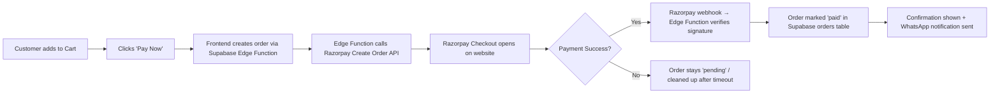

# Customer Payments on TeluguDelicacies.com — Feasibility Analysis

## 1. Current State of the Website

| Aspect | Current State |
|---|---|
| **Tech Stack** | Vanilla JS + Vite + Supabase (BaaS) hosted on Netlify |
| **Cart System** | `localStorage`-based cart (`td_cart` key), full add/remove/quantity controls |
| **Order Flow** | Cart → "Order on WhatsApp" button → Pre-formatted message sent to business WhatsApp (`919618519191`) |
| **Payment Collection** | **None on the website.** WhatsApp message ends with _"Please confirm availability and share payment details!"_ — payment is handled manually, offline |
| **User Accounts** | Supabase Auth exists (`lib/auth.js`) but only used by the **admin panel**. Customers don't have accounts |
| **Database** | Supabase Postgres — tables for `products`, `categories`, `site_settings`, `testimonials`, `why_us_features`. **No `orders` or `payments` table** |
| **Legal Pages** | Privacy Policy, Terms of Use, Shipping & Returns, Cookie Policy all exist in Supabase and are rendered via `legal.html`. They already mention payment gateways and order information in placeholder text |
| **SSL/HTTPS** | ✅ Enforced via `<meta http-equiv="Content-Security-Policy" content="upgrade-insecure-requests">` and Netlify's free SSL |

---

## 2. Why Add Online Payments?

### ✅ Strong Reasons For

| Reason | Details |
|---|---|
| **Reduced Friction** | Currently, a customer must: add to cart → go to WhatsApp → wait for reply → get payment details → transfer manually → wait for confirmation. This is 5+ steps vs a single "Pay Now" checkout |
| **Higher Conversion** | Every redirect to WhatsApp is a dropout point. Many customers abandon when they have to leave the site. Industry data shows that one-click checkout can increase conversion by 20-35% |
| **Trust & Professionalism** | A "Pay Now" button with Razorpay/PhonePe/Stripe branding signals a legitimate, established business |
| **Order Tracking** | An orders table in Supabase lets both admin and customer know exact order status, history, and reduces disputes |
| **Automated Inventory** | Orders can auto-deduct stock, connecting directly to your existing inventory tracking system in Google Sheets / Tally |
| **Scalability** | Manual WhatsApp processing has a ceiling. As order volume grows, payment gateway becomes essential |
| **COD + Prepaid Split** | You can offer both Cash on Delivery and prepaid options, reducing COD rate over time |

### ⚠️ Reasons for Caution

| Concern | Details |
|---|---|
| **FSSAI / Food License Scope** | Your FSSAI license (`13623999000239`) is for food manufacturing. Selling online through payment gateways is **permitted** under this, but large-scale e-commerce may require additional GST compliances (already likely registered) |
| **Perishable Goods Complexity** | Returns/refunds for food items are complex. Need clear non-refundable policy or replacement-only policy |
| **Small Catalogue** | With a focused product range, the ROI of a full payment integration depends on order volume. If you're doing < 50 orders/month, manual WhatsApp may still be cost-competitive |
| **Customer Demographics** | If your primary customers are local Hyderabad residents comfortable with WhatsApp ordering, there may be resistance to change. However, offering BOTH options removes this risk |
| **Operational Readiness** | Payments mean guaranteed orders — you need reliable fulfillment capacity and clear SLAs for dispatch |

---

## 3. How This Can Be Done

### Recommended Approach: **Razorpay Payment Gateway** (India-specific)

Razorpay is the most suitable gateway for an Indian food business because of UPI support, low barrier to entry, and easy client-side integration.

### Architecture Overview

### Implementation Steps

#### Phase 1: Backend Setup (Supabase)

1. **Create `orders` table** in Supabase:
   - `id`, `created_at`, `customer_name`, `customer_phone`, `customer_email`
   - `items` (JSONB — cart snapshot), `total_amount`, `shipping_amount`
   - `payment_status` (pending / paid / failed / refunded)
   - `razorpay_order_id`, `razorpay_payment_id`
   - `fulfillment_status` (received / preparing / shipped / delivered)
   - `delivery_address` (JSONB)

2. **Create Supabase Edge Function** (`create-order`):
   - Receives cart items + customer details from frontend
   - Validates prices server-side (critical for security!)
   - Calls Razorpay Create Order API
   - Inserts record into `orders` table
   - Returns `razorpay_order_id` to frontend

3. **Create Supabase Edge Function** (`verify-payment`):
   - Called by Razorpay webhook after payment
   - Verifies payment signature using Razorpay secret
   - Updates order status to `paid`
   - Optionally sends WhatsApp notification via WhatsApp Business API

#### Phase 2: Frontend Checkout

4. **Add Checkout Form** (before payment):
   - Name, Phone (required), Email, Delivery Address
   - Order summary with item totals
   - Delivery charge display (flat rate or distance-based)

5. **Integrate Razorpay Checkout.js**:
   - Add `<script src="https://checkout.razorpay.com/v1/checkout.js">` 
   - On "Pay Now" click: call Edge Function → open Razorpay modal → handle success/failure callbacks

6. **Keep WhatsApp as fallback** — Offer "Order via WhatsApp" alongside "Pay Now" for customers who prefer manual flow

#### Phase 3: Admin Panel

7. **Add Orders Dashboard** to `admin.html`:
   - View all orders, filter by status
   - Mark orders as preparing / shipped / delivered
   - One-click WhatsApp notification to customer

---

## 4. Cost Implications

### One-Time Costs

| Item | Cost |
|---|---|
| Razorpay Account Setup | **Free** (no setup fee) |
| Development Time | **40-60 hours** if building in-house (Edge Functions, checkout UI, admin orders panel, testing) |

### Recurring Costs

| Item | Cost |
|---|---|
| **Razorpay Transaction Fee** | **2% per transaction** for domestic payments (UPI, cards, wallets, netbanking). No monthly fee on the standard plan |
| **Razorpay UPI-only Fee** | **As low as 0% for UPI** if applying under Razorpay's [UPI subsidy programs](https://razorpay.com/pricing/) — check eligibility |
| **Supabase Edge Functions** | **Free tier** covers 500K invocations/month — more than enough |
| **Supabase Database** | Already within free tier (500MB). Orders table adds minimal overhead |
| **Netlify Hosting** | No change — still static site, Edge Functions run on Supabase |
| **WhatsApp Business API** (optional) | ~₹0.50-1.00 per message if you want automated order confirmations via official API. Or use free manual notification |

### Cost Example

For an order of ₹500:
- **Razorpay fee (UPI)**: ₹0 to ₹10 (0-2%)
- **Razorpay fee (Card/Netbanking)**: ₹10 (2%)
- **GST on fee**: ₹1.80 (18% of ₹10)
- **Total cost per order**: **₹0 to ₹11.80**

> [!TIP]
> Most customers in India prefer UPI, and Razorpay's UPI fees are among the lowest. At current volumes, expect ₹0-2% effective transaction cost.

### Alternative Gateways Comparison

| Gateway | Transaction Fee | UPI Fee | Ease of Integration | Notes |
|---|---|---|---|---|
| **Razorpay** | 2% | 0-2% | ★★★★★ | Best for Indian startups, excellent docs |
| **Cashfree** | 1.90% | 0% (direct UPI) | ★★★★☆ | Slightly cheaper, good alternative |
| **PayU** | 2% | 0% | ★★★☆☆ | Older platform, more complex integration |
| **Stripe** | 3% + ₹2 | Limited UPI | ★★★★★ | Best docs, but pricier for India domestic |
| **PhonePe PG** | 0% on UPI | 0% | ★★★☆☆ | Free UPI, but limited to PhonePe ecosystem |

---

## 5. Safety & Security Implications

### 🟢 What's Already Secure

| Item | Status |
|---|---|
| **HTTPS/SSL** | ✅ Netlify provides free SSL, CSP header enforces upgrade |
| **Supabase RLS** | ✅ Row Level Security is enabled on `products` table |
| **Client-side keys** | ✅ Only Supabase `anon` key is exposed (read-only by RLS policy) |

### 🔴 What Needs to Be Secured for Payments

| Risk | Mitigation | Priority |
|---|---|---|
| **Price Tampering** | Never trust client-side prices. Edge Function must re-fetch product prices from DB and compute total server-side | 🔴 Critical |
| **Razorpay Secret Key Exposure** | Store `razorpay_key_secret` in Supabase Edge Function environment variables, **never** in frontend code | 🔴 Critical |
| **Payment Verification** | Always verify Razorpay payment signature on the server (Edge Function) before marking order as paid | 🔴 Critical |
| **Replay Attacks** | Each Razorpay order has a unique `order_id`. Once paid, mark as consumed. Don't allow re-use | 🟡 High |
| **RLS on Orders Table** | Customers should only read their own orders. Admin (authenticated) can read/write all. Set proper RLS policies | 🟡 High |
| **PCI-DSS Compliance** | Razorpay Checkout.js handles card data in **their** iframe — your site **never** touches card numbers. This keeps you **out of PCI scope** | ✅ Handled by Razorpay |
| **Data Privacy (DPDPA)** | You'll collect customer name, phone, email, address. Update Privacy Policy to disclose this. India's DPDPA 2023 requires consent and data minimization | 🟡 High |
| **Refund Handling** | Implement refund logic through Razorpay API (Supabase Edge Function). Never process refunds client-side | 🟡 Medium |
| **Rate Limiting** | Add rate limits to Edge Functions to prevent abuse (Supabase supports this) | 🟢 Low |

> [!CAUTION]
> The single most important security rule: **Never send product prices from the frontend to the payment creation endpoint.** Always re-fetch prices from the database in the Edge Function. A malicious user can modify `localStorage` cart prices using browser DevTools.

---

## 6. Final Recommendation

### ✅ Verdict: **Feasible and Recommended**

The website is **well-positioned** for payment integration because:

1. **Supabase Edge Functions** provide a secure server-side layer without needing a separate backend server
2. **Cart infrastructure already exists** — the `td_cart` system, UI drawer, quantity controls, and total calculation are all built
3. **Legal pages already mention payments** — the placeholder text in Privacy Policy and Terms already references order information and payment gateways
4. **Auth system exists** — Supabase Auth can be extended to customer accounts (optional, can also do guest checkout)
5. **Razorpay's client-side integration** (Checkout.js modal) fits perfectly into the existing vanilla JS architecture — no framework needed

### Suggested Rollout Strategy

| Phase | Scope | Timeline |
|---|---|---|
| **Phase 1** | Add `orders` table + Edge Functions for order creation and payment verification | 1-2 weeks |
| **Phase 2** | Add checkout form UI + Razorpay Checkout.js integration. Keep WhatsApp as alternative | 1-2 weeks |
| **Phase 3** | Add Orders section to Admin Panel | 1 week |
| **Phase 4** | (Optional) Customer accounts, order history, automated WhatsApp notifications | 2-3 weeks |

> [!IMPORTANT]
> **Keep WhatsApp ordering as a parallel option.** Don't remove it. Some customers prefer the personal touch of messaging. The payment gateway should be an **additional** checkout path, not a replacement.
